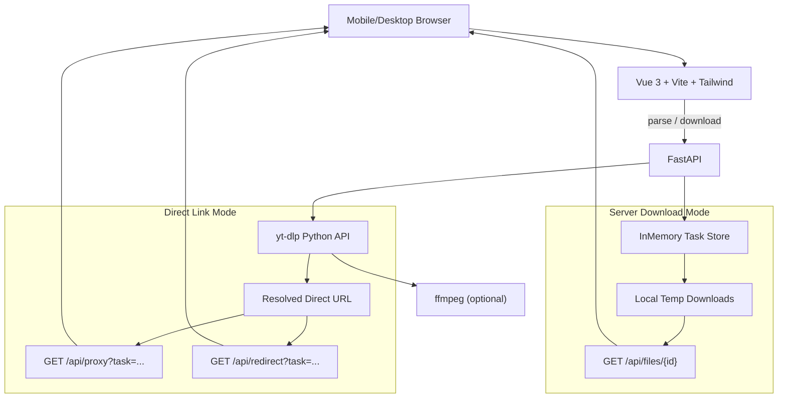

# 方案设计 - 万能视频下载站

> 工程设计长期维护文档。技术选型、架构、接口、安全策略有任何变更都要回写本文件。

## 一、技术栈定稿

| 层 | 选型 | 理由 |
| --- | --- | --- |
| 前端框架 | Vue 3 + Vite + TypeScript | 启动快、生态新、SFC 开发体验好 |
| 样式 | Tailwind CSS | 快速搭 UI、品牌色 token 化、保持 Video School 视觉一致 |
| 后端框架 | FastAPI + Uvicorn | Python 原生 async、Swagger 自带、和 yt-dlp 同语言 |
| 解析/下载引擎 | yt-dlp（Python API） | GitHub 14w+ Star，覆盖 1800+ 平台，持续更新 |
| 媒体处理 | ffmpeg（系统可执行文件） | 音视频合并、字幕嵌入、容器转封装 |
| HTTP 客户端 | httpx | async、支持 streaming、Range 透传 |
| 数据存储 | 无（内存 + 本地临时目录） | MVP 不引入数据库，后续可替换 Redis/SQLite |
| 部署 | 本地 `uvicorn` + `vite dev`；生产预留 Nginx + Docker | 简单优先 |

## 二、架构图



## 三、目录结构

```
free-download-vediowebsite/
├─ docs/                       # 工程文档（本目录）
├─ backend/
│  ├─ requirements.txt         # Python 依赖
│  ├─ .env.example             # 环境变量样板
│  └─ app/
│     ├─ __init__.py
│     ├─ main.py               # FastAPI 入口 + CORS + 生命周期
│     ├─ routes.py             # 所有 HTTP 路由
│     ├─ ytdlp_service.py      # yt-dlp 封装：解析/下载/直链
│     ├─ task_store.py         # 内存任务状态
│     ├─ settings.py           # 配置：超时/并发/临时目录
│     └─ schemas.py            # Pydantic 模型
└─ frontend/
   ├─ package.json
   ├─ vite.config.ts           # 开发代理到 FastAPI
   ├─ tailwind.config.js       # 品牌 token
   ├─ tsconfig.json
   ├─ index.html
   └─ src/
      ├─ main.ts               # Vue 应用入口
      ├─ App.vue
      ├─ styles.css
      ├─ api/
      │  └─ client.ts          # 前端 API 封装
      └─ components/
         ├─ Hero.vue
         ├─ DownloadWorkbench.vue
         ├─ PricingTeaser.vue
         ├─ FAQ.vue
         └─ Footer.vue
```

## 四、yt-dlp 集成方式

核心策略：**封装，不改源码**。

- 通过 `pip install yt-dlp` 引入，后端用 `yt_dlp.YoutubeDL` Python API 调用。
- **解析**：`YoutubeDL({'skip_download': True, 'quiet': True}).extract_info(url, download=False)`，返回元数据后，我方再做"格式整理"：
  - 标记每个 format 是否含视频流 (`vcodec != 'none'`)、是否含音频流 (`acodec != 'none'`)。
  - 提取清晰度档位（height）、扩展名、大小估计（filesize 或 filesize_approx）、fps。
  - 按规则排序，挑出"有音视频的完整单文件"、"最高画质纯视频"、"最高码率纯音频"三类候选。
- **服务端下载**：使用受控 format selector，例如 `bestvideo[ext=mp4]+bestaudio[ext=m4a]/best[ext=mp4]/best`。
  - 下载前检测 ffmpeg，未安装时降级为 `best`（单文件），避免 merge 报错。
  - 使用 `outtmpl`：`{tempdir}/{task_id}/%(title).100s [%(id)s].%(ext)s`，限制长度 + 任务 ID 隔离。
  - 挂 `progress_hooks`：增量写入任务状态（百分比、已下载字节、ETA、速度）。
- **直链模式**：从 format 中拿 `url`，同时记录 `http_headers`（Referer/UA/Cookie），存入任务状态，供 `/api/proxy` 或 `/api/redirect` 使用。
- **字幕**：`writesubtitles` / `writeautomaticsub` / `subtitleslangs` / `subtitlesformat`。解析阶段仅返回语言列表，下载阶段用户勾选再启用。
- **安全约束**：前端不允许传任意 yt-dlp 参数，只接受受控枚举（清晰度档位、音频/视频、字幕语言、下载模式）。

### 三种下载模式对比

| 模式 | 后端处理 | 带宽/磁盘 | 画质 | 兼容性 | 适用场景 |
| --- | --- | --- | --- | --- | --- |
| `server` | 下载 → 合并 → 暂存 → 返回文件流 | 高 | 最高（合并最佳 video+audio） | 高 | 需要最高画质/合并/嵌字幕 |
| `proxy` | 解析直链 → 流式代理 | 中（转发流量） | 单流最高（不合并） | 中（支持 Range 断点续传） | 节省磁盘、又要带 Referer |
| `redirect` | 解析直链 → 302 | 极低 | 单流最高 | 低（部分平台 Referer 校验失败） | 轻负载、简单平台 |

## 五、后端接口草案

下面列出 MVP 必须的接口，详细字段以 `api.md`（后续补齐）为准。

| 方法 | 路径 | 说明 |
| --- | --- | --- |
| GET | `/api/health` | 健康检查 |
| POST | `/api/parse` | 解析单个 URL，返回元数据 + 格式列表 + 字幕列表 + `task_id` |
| POST | `/api/parse/batch` | 批量解析，逐条返回结果或错误 |
| POST | `/api/download` | 触发下载（`mode` = `server` / `proxy` / `redirect`） |
| GET | `/api/tasks/{task_id}` | 任务状态与进度 |
| GET | `/api/files/{task_id}` | 服务端模式：文件流下载 |
| GET | `/api/proxy` | 直链代理（带 Range + http_headers） |
| GET | `/api/redirect` | 302 到直链 |

### 统一错误模型

```json
{
  "error": {
    "code": "parse_failed | unsupported_site | geo_blocked | need_login | expired_url | invalid_url | task_not_found | ffmpeg_missing | internal",
    "message": "人类可读说明",
    "hint": "建议的下一步操作（可选）"
  }
}
```

### 任务状态模型

```json
{
  "task_id": "uuid",
  "status": "queued | parsing | ready | downloading | done | error",
  "progress": 0.0,
  "speed": "1.2MiB/s",
  "eta": 42,
  "mode": "server | proxy | redirect",
  "download_url": "/api/files/xxx 或 /api/proxy?... 或直链（仅 redirect）",
  "metadata": { "title": "...", "duration": 120, "thumbnail": "..." },
  "error": null
}
```

## 六、安全与稳定性

- **URL 校验**：只允许 `http` / `https`；解析主机名后拒绝本地地址（`localhost`、`127.0.0.0/8`、`::1`）、私有地址（10/8、172.16/12、192.168/16）、链路本地（169.254/16）、以及 `file://`、`ftp://` 等协议。
- **参数受控**：前端只能传 `format_id`（来自解析返回的合法列表）、`mode`、`subtitle_langs`；不允许自由字符串写进 yt-dlp。
- **Python API 调用**：不拼接 shell，所有参数通过 `ydl_opts` 字典传入。
- **任务限制**：
  - 单批解析 URL 数 ≤ 10。
  - 下载并发 ≤ 配置项（默认 3），超出排队。
  - 单任务超时（默认 600s）。
  - 文件保留时间（默认 1 小时）到期自动清理。
- **文件安全**：
  - 输出目录按 `task_id` 隔离。
  - 文件名清理特殊字符，限制长度 ≤ 100 字节。
  - 下载端点通过 task_id 查表，不接受路径参数，避免路径穿越。
- **代理安全**：
  - `/api/proxy` 只接受服务器刚解析出的、存在于任务状态里的直链。
  - 前端传 `task_id + format_id`，后端查表拿真实 URL，不允许前端自由传 URL。
  - 透传 Range 请求头；透传 yt-dlp 提供的 `http_headers`（Referer/UA）。
- **错误映射**：捕获 yt-dlp 抛出的 `DownloadError` / `ExtractorError`，根据 message 关键字映射到统一 error code（geo/login/unsupported/expired）。
- **清理策略**：启动时扫描临时目录删除孤儿文件；周期性后台任务每 N 分钟扫描任务状态，清理过期文件。

## 七、UI 设计方向

参考 [Video School](https://www.videoschool.com/) 的视觉语言，但不照搬。

- **配色**：白底 + 青绿色品牌色（主 CTA） + 亮黄强调色（付费/促销徽章） + 粗黑标题。
- **装饰**：手绘贴纸、涂鸦图标、圆角大卡、真人感/课程感卡片布局。避免通用 SaaS 干净渐变。
- **首屏结构**：品牌导航 → 强标题 → URL 输入框（大、圆角、焦点有轻微弹性）→ 批量入口 → 立即解析按钮 → 会员权益卡。
- **中部结构**：三步使用流程 → 支持平台 logo 墙（强调 1800+ 网站）→ Free vs Pro 对比卡 → FAQ → 合规提醒。
- **移动端优先**：大输入框、大按钮、下载任务卡；避免横滚；首屏核心 CTA 在一屏内。

## 八、扩展点（为后续版本预留）

- 字幕翻译 / AI 摘要：后端预留 `/api/translate-subtitle` 接口占位，前端"Pro only"标签。
- 用户系统 / 支付：前端预留入口，接入时仅替换登录态与支付 webhook。
- 持久化：内存 task store 抽象成接口，后续可替换 Redis。
- 进度推送：当前用轮询，将来可升级 SSE 或 WebSocket。
- 登录态/Cookie：后续管理面可暴露 `cookies-from-browser` 或上传 cookies.txt，MVP 阶段不做。

## 九、维护节奏

- 架构/接口变更 → 改本文件 + `api.md`（若已建）；重大权衡新增 `decisions/NNN-*.md`。
- 新增/删除依赖 → 更新本文件的"技术栈"表与 `backend/requirements.txt` / `frontend/package.json`。
- 每阶段验收后 → 回写 `changelog.md`，校对本文件与代码差异。
