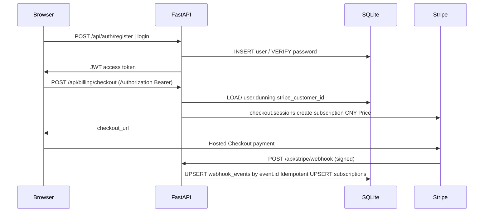

# Stripe 会员（SQLite + JWT + Checkout 订阅）实现计划

> 本文档由 Cursor 计划 `stripe_会员_jwt+sqlite_ae99f88d` 复制到 `docs/`，作为仓库内正式方案副本；实现过程中以本文件与 `docs/design.md` 为准同步维护。

## 实现待办（跟踪用）

- [x] 新增 SQLite 初始化与 models：users / subscriptions / stripe_events + 索引与 Repository 封装 — `backend/app/db.py`（v0.7.0）
- [x] 实现 register / login / me、bcrypt、JWT、FastAPI Bearer 依赖与 `/api/auth` 路由 — `backend/app/security.py` + `auth_routes.py`（v0.7.0）
- [x] settings 环境变量；stripe checkout + customer 复用；raw body Webhook verify + 事件处理 + `event.id` 幂等 — `settings.py` + `billing_routes.py` + `webhook_routes.py`（v0.7.0）
- [x] 登录注册页；`client.ts` Bearer；`PricingTeaser` 结账跳转；成功页轮询 me（v0.7.1）
- [x] `backend/.env.example` 与前端说明；`docs/design` + `changelog`；本地 Stripe CLI 联调清单 — `.env.example` + `docs/stripe-impl-report.md` + `changelog.md`（v0.7.0）

> 关联交付报告：[`docs/stripe-impl-report.md`](./stripe-impl-report.md)。前端闭环与 Webhook 联机修复见 **v0.7.1**（`docs/changelog.md`）。前端价格已同步为 ¥12/月；CORS bug（`allow_origins=[] or ["*"]` + `credentials=True`）一并修复。

---

## 背景与约束（已确认）

- **数据库**：SQLite 单文件（如 [`backend/billing.db`](../backend/billing.db) 或通过 `BILLING_DB_PATH` 配置），与现有「无 DB」MVP 并存，仅承载会员与认证数据。
- **计价**：Stripe **人民币 CNY**，**12 元/月**（Stripe 金额用最小货币单位：**1200**，即 12.00 CNY）。
- **本地联调**：已安装 **Stripe CLI**，用 `stripe listen --forward-to` 转发 Webhook 到本机 FastAPI。
- **身份**：**先注册/登录再买**；Checkout 必须带 **JWT**；`client_reference_id` = 内部 `user_id`（UUID 字符串），Webhook 与 DB 以该 ID 或 `metadata` 归并到用户。

**身份方案说明**：已选「JWT + 先账号」。**第一期实现邮箱 + 密码注册/登录（bcrypt）+ JWT**，Magic Link 作为后续迭代。若第一期必须 Magic Link，需单独调整范围。

---

## 架构与数据流

---

## 1. Stripe 侧（你先做 / 或由脚本创建一次）

在 Dashboard **测试模式**下：

1. 创建 Product（如「UltraGrab Pro」）与 **月付 recurring Price**，币种 **CNY**，金额 **¥12**。记下 **`price_...`**，写入服务端环境变量 **`STRIPE_PRICE_PRO_MONTHLY`**（推荐用 Price ID，避免代码里硬编码产品名）。
2. 配置 **Customer Portal**（允许取消/更新支付方式等），以便后续接「管理订阅」。
3. **Webhook**：本地用 Stripe CLI：`stripe listen --forward-to http://127.0.0.1:8000/api/stripe/webhook`，将 CLI 给出的 **`whsec_...`** 设为 **`STRIPE_WEBHOOK_SECRET`**。

---

## 2. SQLite 模型（后端）

新建模块（建议在 [`backend/app/`](../backend/app/) 下）：

- **`users`**：`id` (UUID TEXT PK)、`email` UNIQUE、`password_hash`、`stripe_customer_id` NULLABLE、`created_at`。
- **`subscriptions`**：`user_id` FK、`stripe_subscription_id` UNIQUE、`stripe_price_id`、`status`、`current_period_end`（整数 epoch，便于展示）、`cancel_at_period_end`（0/1）、`updated_at`。
- **`stripe_events`**：`event_id` PRIMARY KEY（Stripe `evt_...`），`type`、`received_at`，用于 **Webhook 幂等**：同一 `event.id` 只处理一次，重复投递直接返回 200。

索引：`subscriptions(user_id)`、`subscriptions(status)`。

---

## 3. 后端实现要点

### 3.1 配置

扩展 [`backend/app/settings.py`](../backend/app/settings.py)：

- `JWT_SECRET`、`JWT_EXPIRES_SECONDS`（如 7d）
- `STRIPE_SECRET_KEY`、`STRIPE_WEBHOOK_SECRET`、`STRIPE_PRICE_PRO_MONTHLY`
- `PUBLIC_FRONTEND_ORIGIN`（无尾斜杠，用于 `success_url` / `cancel_url`，如 `http://127.0.0.1:5173`）
- `BILLING_DB_PATH`（默认 `backend/billing.db`）

同步更新 [`backend/.env.example`](../backend/.env.example)（不写真实密钥）。

### 3.2 依赖

[`backend/requirements.txt`](../backend/requirements.txt)：增加 **`stripe`**、**`PyJWT`**（或等价）、**`passlib[bcrypt]`**。

### 3.3 认证 API（新路由，`/api/auth`）

- `POST /api/auth/register`：`email` + `password`，校验邮箱格式与密码最小长度；写入 `users`；返回 JWT。
- `POST /api/auth/login`：校验密码；返回 JWT。
- 可选：`GET /api/auth/me`：Bearer JWT → 返回 `email`、`subscription` 概要（读 `subscriptions` 最新活跃行）。

**JWT Claims**：至少 `sub` = `user_id`，`email`（可选）。

### 3.4 结账 API（新路由，`/api/billing`，**必须鉴权**）

- `POST /api/billing/checkout`：
  - 从 JWT 解析 `user_id`。
  - 若 `users.stripe_customer_id` 为空：调用 Stripe **`customers.create`**（`email`=`user.email`，`metadata.app_user_id`=`user.id`），写回 DB。
  - **`checkout.sessions.create`**：`mode=subscription`，`line_items=[{price: STRIPE_PRICE_PRO_MONTHLY, quantity:1}]`，`customer`=`cus_...`，**`client_reference_id=user.id`**，`metadata.user_id=user.id`，`success_url` / `cancel_url` 指向前端（可带 `session_id={CHECKOUT_SESSION_ID}` 仅作展示）。
  - 返回 `{ "url": session.url }`（前端 `window.location` 跳转）。

**幂等说明**：用户重复点击「开通」会创建多个 **Session**，但只有完成支付的客户会触发 Webhook；若需限制「已有 active 订阅不可再买单」，可加业务校验（建议 **加**：若 `subscriptions.status in ('active','trialing')` 则返回 409 或返回 Portal URL）。

### 3.5 Webhook（`POST /api/stripe/webhook`）

- **禁用 JSON 中间件对 raw body 的消耗**：FastAPI 中对该路由使用 **`Request.body()`** 读 **原始 bytes**，用 **`stripe.Webhook.construct_event`** 校验 **`Stripe-Signature`**。
- 处理事件（最小集，可迭代补充）：
  - **`checkout.session.completed`**：`client_reference_id` / `metadata` → `user_id`；`subscription`/`customer` 写入/更新 **`subscriptions`** 与 **`users.stripe_customer_id`**（如需）。
  - **`customer.subscription.updated` / `deleted`**：按 `subscription.id` 更新 `subscriptions.status`、周期结束、`cancel_at_period_end`。
  - **`invoice.paid` / `invoice.payment_failed`**：可选补强（失败可标记 `past_due` 或依赖 subscription 状态）。
- **每条事件**：先 **`INSERT OR IGNORE` 进 `stripe_events`**；若已存在则 **直接 200**（幂等）。

### 3.6 注册路由

在 [`backend/app/main.py`](../backend/app/main.py) 中 `include_router` 新模块；**CORS** 已有，若前端带 `Authorization` 需确认 `allow_headers` 已含（当前为 `*`，一般无问题）。

---

## 4. 前端实现要点

- **API 封装** [`frontend/src/api/client.ts`](../frontend/src/api/client.ts)：支持可选 `Authorization: Bearer <token>`；401 时可清 token（简单行为即可）。
- **状态**：`localStorage` 存 JWT（或 `sessionStorage`，先选 `localStorage` 以符合常见 SPA）。
- **新页面/组件**（保持与现有 Tailwind/Video School 风格一致）：
  - 登录 / 注册表单（可两个路由如 `/login`、`/register`，或单页 Tab）。
  - `PricingTeaser`：已登录且非 active 时按钮调用 `POST /api/billing/checkout` 并跳转；未登录则引导去登录。已订阅可显示「管理订阅」（第二期接 Portal 或本期若时间允许加 `POST /api/billing/portal`）。
- **成功页**（可选简单路由 `/billing/success`）：只读 `session_id` 展示「处理中，请稍候」并轮询 `GET /api/auth/me` 直到 `subscription` 为 active（**最终以 Webhook 为准**，轮询仅为 UX）。

---

## 5. 安全与支付注意点（实现时落实）

- **密钥**：`STRIPE_SECRET_KEY`、`JWT_SECRET`、`STRIPE_WEBHOOK_SECRET` 仅服务端与本地 `.env`，不入库不提交。
- **Webhook**：仅信任 `construct_event` 后的对象；业务更新只在此路径写库。
- **幂等**：`stripe_events.event_id` 去重；订阅状态以 Stripe 对象为源，覆盖写 `subscriptions`。
- **密码**：bcrypt cost 合理；可选速率限制留给后续（MVP 可略）。
- **重复订阅**：见 3.4 建议在服务端拦截已有活跃订阅重复买单。

---

## 6. 文档与自检

- 回写 [`docs/design.md`](./design.md) 增补「用户 / 计费 / Stripe」小节；[`docs/changelog.md`](./changelog.md) 记一条版本说明（若同时补 [`docs/api.md`](./api.md) 另说）。
- **自检**：注册 → 登录拿 JWT → Checkout 跳转 → 测试卡支付 → CLI Webhook → DB 出现 `subscriptions` active → 前端 `/auth/me` 显示已开通。

---

## 7. 与你未决事项的衔接

- **Magic Link**：未纳入本期代码路径；后续可替换密码列为「无密码」并接邮件验证。
- **人民币**：以 Dashboard 中 **CNY Price** 为唯一真相；前端「¥12/月」与 Stripe 保持一致即可。
