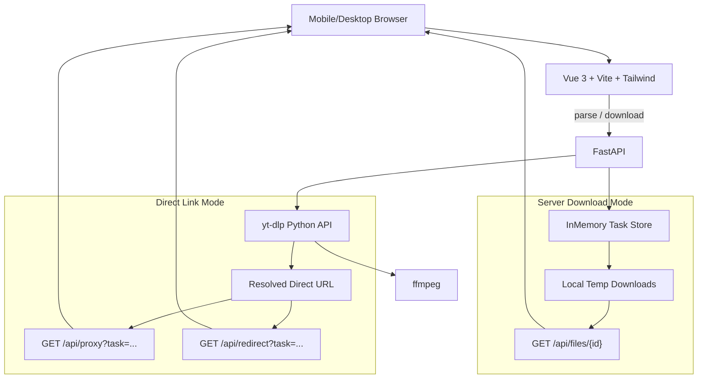

# 万能视频下载站开发方案

## 技术栈定稿

- 前端：`Vue 3` + `Vite` + `Tailwind CSS`，仿 Video School 风格。
- 后端：`FastAPI` + `yt-dlp`（Python），无数据库，轻量级。
- 核心能力：依赖 `yt-dlp`（GitHub 14w+ Star，支持 1800+ 网站），不修改源码，只做封装。
- 辅助依赖：`ffmpeg`（音视频合并/字幕嵌入）、`httpx`（直链代理转发）、`uvicorn`（ASGI 运行）。

## 目标边界

第一版做成可演示、可本地运行、适合后续商业化扩展的 MVP：

- 支持单个视频链接解析：标题、封面、时长、可选清晰度/格式、字幕信息。
- 支持批量链接提交：逐条解析/下载，展示状态与失败原因。
- 支持两种下载模式（前端可选）：
  - **服务端下载模式**：后端用 yt-dlp 下载到临时目录，合并音视频/嵌字幕后返回内部下载链接，适合需要合并或最高画质的场景。
  - **直链模式**：只解析不下载，拿到 yt-dlp 返回的直链后，默认通过后端代理转发给浏览器（带正确的 Referer/User-Agent），可选择直接 302 重定向给浏览器（轻负载）。
- 支持字幕下载入口：先实现原字幕/自动字幕获取；翻译功能先预留 UI 与 API 边界。
- 暂不接数据库：任务状态放内存，下载文件放本地临时目录，定时清理。
- 暂不接真实支付：页面突出会员价值与付费动机，支付后续可接 Stripe/Creem/国内支付。
- 明确合规边界：仅用于用户有权下载的公开/授权内容，不绕过 DRM、付费墙或平台访问控制。

## UI 设计方向

参考 [Video School](https://www.videoschool.com/) 的视觉语言，但不照搬：

- 使用白底、青绿色品牌色、明亮黄色强调色、粗黑标题，营造“轻松但可信”的学习/工具感。
- 使用手绘贴纸、涂鸦图标、圆角大卡片、真人感/课程感的内容卡布局，避免普通 SaaS 模板感。
- 首页核心文案围绕付费价值：批量、省时间、高清、字幕、手机可用。
- 首屏结构：品牌导航、强标题、URL 输入框、批量入口、立即解析按钮、会员权益卡。
- 中部结构：三步使用流程、支持平台说明、会员方案卖点、常见问题、合规提醒。
- 移动端优先：大输入框、大按钮、下载任务卡片，确保手机浏览器能操作。

## 技术架构

推荐新建的主要文件路径：

- [frontend/package.json](frontend/package.json)：Vue 3 + Vite + Tailwind 依赖与脚本。
- [frontend/tailwind.config.js](frontend/tailwind.config.js)：品牌色、字体、手绘装饰所需的扩展配置。
- [frontend/vite.config.ts](frontend/vite.config.ts)：Vite 配置与开发代理到 FastAPI。
- [frontend/src/main.ts](frontend/src/main.ts)：Vue 应用入口。
- [frontend/src/App.vue](frontend/src/App.vue)：主页面（首屏 + 下载工作台）。
- [frontend/src/components/Hero.vue](frontend/src/components/Hero.vue)：Video School 风格首屏。
- [frontend/src/components/DownloadWorkbench.vue](frontend/src/components/DownloadWorkbench.vue)：URL/批量输入、格式与下载模式切换、任务列表。
- [frontend/src/components/PricingTeaser.vue](frontend/src/components/PricingTeaser.vue)：会员价值与付费引导。
- [frontend/src/api/client.ts](frontend/src/api/client.ts)：前端 API 封装。
- [frontend/src/styles.css](frontend/src/styles.css)：Tailwind 入口 + 全局品牌样式。
- [backend/requirements.txt](backend/requirements.txt)：`fastapi`、`uvicorn`、`yt-dlp`、`httpx`、`pydantic` 等依赖。
- [backend/app/main.py](backend/app/main.py)：FastAPI 应用入口与 CORS。
- [backend/app/routes.py](backend/app/routes.py)：解析、下载任务、文件下载、代理/重定向路由。
- [backend/app/ytdlp_service.py](backend/app/ytdlp_service.py)：封装 yt-dlp 的解析和下载。
- [backend/app/task_store.py](backend/app/task_store.py)：无数据库任务状态管理与清理。
- [backend/app/settings.py](backend/app/settings.py)：下载目录、超时、并发、代理白名单配置。
- [README.md](README.md)：安装、启动、测试、合规说明。

## yt-dlp 集成方式

采用“封装，不修改源码”的方式：

- 通过 Python 环境安装 `yt-dlp`，后端用 `yt_dlp.YoutubeDL` Python API 调用，并把 CLI 当作降级路径。
- 解析元数据使用 `YoutubeDL({'skip_download': True}).extract_info(url, download=False)`，不下载文件。
- 返回给前端的 `formats` 中挑选既有视频又有音频的组合、以及仅视频、仅音频的高质量候选。
- 服务端下载使用安全默认格式选择，例如 `bestvideo[ext=mp4]+bestaudio[ext=m4a]/best[ext=mp4]/best`。
- 字幕使用 `writesubtitles`、`writeautomaticsub`、`subtitleslangs`、`subtitlesformat` 参数。
- 需要安装 `ffmpeg`，用于合并音视频、转封装和字幕处理；未安装时降级为 `best` 单文件模式。
- 不允许前端透传任意 yt-dlp 参数，只接受受控枚举（清晰度档位、音频/视频、字幕语言）。

### 下载模式的实现要点

- **服务端下载模式**：创建任务 → 后台线程运行 `YoutubeDL.download` → 任务完成后通过 `GET /api/files/{task_id}` 以 `StreamingResponse` 返回，文件名从元数据构造。
- **直链模式（代理）**：从 `formats` 选中的 `url` 字段取直链；`GET /api/proxy?task={id}&format={fmt}` 用 `httpx.AsyncClient.stream` 转发，透传 `Range` 请求头并带上 yt-dlp 给出的 `http_headers`（Referer/UA/Cookie），浏览器可断点续传，不暴露原始直链。
- **直链模式（重定向）**：`GET /api/redirect?task={id}&format={fmt}` 返回 302 到直链。前端提示用户部分平台（如 B 站）依赖 Referer，直链直跳可能失败，此时会自动回退到代理模式。
- 所有模式统一使用同一套解析结果和任务 ID，前端通过 `mode` 字段切换。

## 后端接口草案

- `GET /api/health`：健康检查。
- `POST /api/parse`：body `{ url }`，返回标题、封面、时长、格式列表（含清晰度、大小估计、是否含音频）、可用字幕语言、任务 ID。
- `POST /api/parse/batch`：body `{ urls: [] }`，返回每条的解析结果或错误。
- `POST /api/download`：body `{ task_id, format_id, mode: 'server' | 'proxy' | 'redirect', subtitle_langs?: [] }`；服务端模式返回 `task_id` 用于轮询，直链模式直接返回可访问的代理/重定向 URL。
- `GET /api/tasks/{task_id}`：任务状态与进度（`queued`/`downloading`/`done`/`error`、百分比、下载地址、错误原因）。
- `GET /api/files/{task_id}`：服务端模式下的文件流下载。
- `GET /api/proxy`：直链代理，透传 Range 与 yt-dlp 提供的 http_headers。
- `GET /api/redirect`：302 到直链（可能因 Referer 失败）。

## 后端安全与稳定性

- URL 校验：只允许 http/https，拒绝本地地址、内网地址、file 协议，降低 SSRF 风险。
- Python API 调用：不使用 shell 拼接，所有参数通过 `ydl_opts` 字典传入。
- 任务限制：限制单批数量、并发下载数、单任务超时、最大文件保留时间。
- 文件安全：使用任务 ID 命名目录，下载文件名清理，禁止路径穿越。
- 代理安全：`/api/proxy` 只接受服务器刚解析出的、由我方签名/存放在任务状态中的直链，不允许前端自定义 URL。
- 错误处理：把 yt-dlp 的失败信息转成用户可理解提示（地域受限、需要登录、平台不支持等）。
- 清理策略：启动时和任务完成后定期清理临时文件与过期任务状态。

## 文档沉淀规则（全局约定）

- 所有项目级文档一律放 [docs/](docs/)，**不放在 `.cursor/` 或任何临时目录**。
- 后续每次扩展新功能，AI 都必须先读 `docs/` 再动手；如果需求/方案变化，要同步修改 `docs/` 内对应文件。
- 首批落地 4 份文档：
  - [docs/README.md](docs/README.md)：文档总览与阅读顺序（需求 → 方案 → 计划 → 接口/迭代记录）。
  - [docs/requirements.md](docs/requirements.md)：产品需求分析（目标用户、核心场景、功能清单、非功能要求、合规边界、成功指标）。
  - [docs/design.md](docs/design.md)：方案设计（技术栈、架构图、目录结构、yt-dlp 封装与三种下载模式、API 设计、安全策略、UI 方向、扩展点）。
  - [docs/plan.md](docs/plan.md)：本计划的固化版本，列出五阶段路线与验收节点（把当前 `.cursor/plans/*.plan.md` 的主体内容搬进去，后续所有计划变更都改这个文件）。
- 新增文档命名约定（后续添加）：
  - `docs/api.md`：接口详细说明（参数/响应/错误码）。
  - `docs/changelog.md`：每期交付的功能差异。
  - `docs/decisions/NNN-*.md`：重要技术决策记录（ADR 风格，便于追溯"为什么这么选"）。

## 分阶段交付（按你的路线）

### 阶段 0 — 文档落地（先于写代码）

交付：项目根目录出现 `docs/` 并包含需求、方案、计划三份主文档。

- 新建 `docs/` 目录。
- 写入 `requirements.md`（基于本计划"目标边界""UI 设计方向""合规边界"展开，明确 Must / Should / Could）。
- 写入 `design.md`（把"技术栈定稿""技术架构""yt-dlp 集成方式""后端接口草案""安全与稳定性"整理成可长期维护的工程文档）。
- 写入 `plan.md`（阶段 1–5 路线与验收节点，作为后续迭代对照表）。
- 写入 `README.md`（文档导航）。
- 从此，`.cursor/plans/` 不再作为唯一源，计划若有变动需同步改 `docs/plan.md`。

### 阶段 1 — 后端核心 API（FastAPI + yt-dlp 封装）

交付：只跑后端就能用 curl/Postman 验证。

- 初始化 `backend` 目录、`requirements.txt`、`uvicorn` 启动脚本、`.env.example`。
- 封装 [backend/app/ytdlp_service.py](backend/app/ytdlp_service.py)：解析、格式整理、服务端下载、直链解析。
- 接口：
  - `GET /api/health`。
  - `POST /api/parse`：返回标题、封面、时长、格式列表（含清晰度/大小/音视频标志）、字幕语言、任务 ID。
  - `POST /api/download`：`mode` = `server | proxy | redirect`。
  - `GET /api/tasks/{id}`：任务状态/进度/下载地址/错误原因。
  - `GET /api/files/{id}`：服务端模式流式下载。
  - `GET /api/proxy`：直链代理（透传 Range + `http_headers`）。
  - `GET /api/redirect`：302 到直链。
- 基础防护：URL 协议/内网过滤、单用户并发上限、任务超时、临时文件清理。
- 验证：阶段内用 `curl` 或 FastAPI 的 Swagger (`/docs`) 完成解析→三种下载模式全绿。

### 阶段 2 — 前端骨架（Vue 3 + Vite + Tailwind）

交付：前端可独立 `npm run dev`，页面骨架齐备但接口调用先用 mock。

- 初始化 `frontend`（Vite + Vue 3 + TS + Tailwind），配置到 `/api` 的开发代理。
- 组件结构：`Hero.vue`、`DownloadWorkbench.vue`（输入框 + 格式选择 + 下载模式切换 + 任务卡）、`PricingTeaser.vue`、`FAQ.vue`、`Footer.vue`。
- 搭好路由/状态管理（`pinia` 可选，先用 composable）、`api/client.ts` 的封装与 mock。
- 响应式 grid、品牌 token（颜色、字体、手绘贴纸位）先落到 Tailwind config，UI 精雕留到阶段 4。

### 阶段 3 — 端到端 MVP（前后端联调，必须可跑通）⭐

交付：一个能对外演示的最小可用版本。

- 前端改成调用真实后端：`/api/parse` → 展示视频信息与格式列表 → 选择清晰度 + 下载模式 → 触发下载。
- 服务端模式：前端轮询 `/api/tasks/{id}`，完成后点击下载按钮拿文件。
- 直链模式：前端直接跳转到 `/api/proxy` 或 `/api/redirect` 的 URL，浏览器原生下载。
- 简单错误提示：非法 URL、解析失败、平台不支持、直链过期建议切换模式。
- 阶段结束自测清单：YouTube、Bilibili、X/Twitter 任选 2 个公开链接，三种模式各跑一次成功。
- **这是第一个可跑通的 MVP，交付给你一次验收。**

### 阶段 4 — UI 精雕 + 付费引导

- 按 [Video School](https://www.videoschool.com/) 提炼的视觉语言精修：白底、青绿色主色、亮黄强调、粗黑标题、手绘贴纸/涂鸦、圆角大卡。
- 付费引导区：`Free vs Pro` 对比卡、会员价值点（批量、4K、去水印、字幕翻译、无限历史、手机端优先）、限时 `GET 50% OFF` 横幅、FAQ。
- 支持平台展示：用 logo/图标墙列出 YouTube、TikTok、Bilibili、Instagram、X、Facebook、Vimeo 等代表平台，强调 1800+ 网站覆盖。
- 页面动效：一次性的首屏交错出场动画、hover 微交互，避免通用 SaaS 味。

### 阶段 5 — 扩展能力

- 字幕下载：前端解析后显示字幕语言列表，下载时可勾选；翻译/AI 总结先做成 `Pro 专属` 占位入口。
- 下载进度：服务端模式接 yt-dlp 的 `progress_hooks`，通过 `/api/tasks/{id}` 或 SSE 推给前端，显示百分比 + 速度 + 剩余时间。
- 历史记录：浏览器 `localStorage` 存最近任务（无数据库约束下的轻量方案），支持重试、清空。
- 移动端优化：大按钮、吸底下载条、粘贴剪贴板识别、批量粘贴体验调优。

## 阶段验证与验收节点

- **阶段 0 验收点**：`docs/` 下四份文档齐备、可读、引用关系清晰。
- **阶段 1 验收点**：`curl`/Swagger 三模式全绿，不需要前端。
- **阶段 3 验收点**：本地 `npm run dev` + `uvicorn` 能完整跑通真实链接下载（MVP 里程碑）。
- **阶段 4 验收点**：UI 在 1440 桌面 + 390 移动两个断点下形态正确、视觉稳定。
- **阶段 5 验收点**：字幕、进度、历史、移动端分别完成演示 + 已知限制说明。

## 文档维护节奏

- 每完成一个阶段：必须回写 `docs/changelog.md`（简述做了什么、验证了什么、已知限制）。
- 涉及架构/接口变更：同步更新 `docs/design.md` 相关小节；如果决策有权衡，新增 `docs/decisions/NNN-*.md`。
- 接口改动：同步更新 `docs/api.md`。
- 若需求范围调整：同步更新 `docs/requirements.md`，让文档始终与实现同步。

## 验证计划

- 后端：运行 `uvicorn`，验证 `/api/health`、解析接口、三种下载模式、任务状态、文件流、代理与重定向。
- 前端：运行 Vite dev server，验证桌面和移动宽度下的输入、批量列表、模式切换、状态刷新、下载按钮。
- 构建：执行前端 `vite build`，确保无类型/构建错误。
- yt-dlp：使用公开视频链接验证解析、格式选择、下载、字幕可用性；对 ffmpeg 缺失做降级验证。
- 失败场景：非法 URL、不可下载链接、平台反爬、直链过期、超时、批量部分失败。

## 人工确认点

请确认是否按这个阶段化方案进入开发：
- 技术栈 `Vue 3 + Vite + Tailwind + FastAPI + yt-dlp + 无数据库`
- 三种下载模式 `服务端下载 / 直链代理 / 直链重定向`
- 五阶段节奏：阶段 1 后端 → 阶段 2 前端骨架 → **阶段 3 端到端 MVP（第一次验收）** → 阶段 4 UI 精雕 + 付费引导 → 阶段 5 字幕/进度/历史/移动端
- 第一次批量验收在阶段 3 结束时

确认后我会切到 Agent 模式，从阶段 1 开始写代码，每个阶段内部自测，阶段 3 结束会主动找你做 MVP 验收。